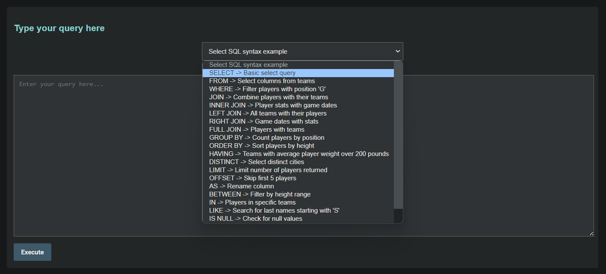

# NBA Data Query Playground

A web app for practicing SQL with NBA data. Fetches data from the balldontlie API and stores it in SQLite. Users can query the data via a web interface and convert natural language to SQL using OpenAI.

## Features

- **Fetch and store NBA data**: Retrieves data on teams, players, games, and player stats from the balldontlie API and stores it in a SQLite database.
- **SQL Query Interface**: Allows users to execute SQL queries against the database via a user-friendly web interface.
- **SQL Syntax Examples**: Provides examples of common SQL queries for users to learn and practice.
- **Natural Language to SQL**: Converts natural language queries to SQL using OpenAI, helping users understand SQL query construction.

## Screenshots and Descriptions

### Data Tables


*Displays data retrieved from the balldontlie API, including tables for players, teams, games, and stats.*

### SQL Syntax Examples Dropdown


*The dropdown menu allows users to select from various SQL syntax examples to help them learn and construct queries.*

### Query Execution


*Users can type their SQL queries in the input box and see the results displayed below after clicking "Execute".*

### LLM Help - Natural Language to SQL


*Users can input natural language queries, and the app will suggest corresponding SQL queries using OpenAI.*

### LLM Explanation of SQL Queries


*The app can also explain SQL queries in natural language, helping users understand what each query does.*

## Setup and Installation

### Prerequisites

- Python 3.x
- Flask
- Pandas
- Requests
- OpenAI Python package
- SQLite

### Installation

1. **Clone the repository**:

    ```sh
    git clone https://github.com/Usamah1997/nba-data-query-playground.git
    cd nba-data-query-playground
    ```

2. **Create a virtual environment and activate it**:

    ```sh
    python -m venv venv
    venv\Scripts\activate  # On Windows
    ```

3. **Install the dependencies**:

    ```sh
    pip install -r requirements.txt
    ```

4. **Set up API keys**:

    Replace the placeholders in the `fetch_data.py` and `app.py` files with your actual API keys.

    ```python
    # fetch_data.py and app.py
    API_KEY = 'your-balldontlie-api-key'
    OPENAI_API_KEY = 'your-openai-api-key'
    ```

### Usage

1. **Retrieve NBA Data**:

    Run the script to fetch data from the balldontlie API and store it in CSV files and SQLite database:

    ```sh
    python fetch_data.py
    ```

2. **Run the Flask Application**:

    ```sh
    flask run
    ```

3. **Open your web browser** and go to `http://127.0.0.1:5000/` to use the application.

### Project Structure

- `fetch_data.py`: Script to fetch data from the balldontlie API and store it in CSV files and SQLite database.
- `app.py`: Flask application to provide a web interface for querying the data.
- `templates/index.html`: HTML template for the web interface.
- `static/style.css`: CSS for the web interface.
- `requirements.txt`: List of Python dependencies.

### Example Queries

- **Find all players with the position 'G'**:

    ```sql
    SELECT * FROM players WHERE position = 'G';
    ```

- **List all teams in the East conference**:

    ```sql
    SELECT * FROM teams WHERE conference = 'East';
    ```

- **Get the names and weights of all players in team 1**:

    ```sql
    SELECT first_name, last_name, weight_pounds FROM players WHERE team_id = 1;
    ```

### Contributing

Contributions are welcome! Please open an issue or submit a pull request for any improvements or bug fixes.

### License

This project is licensed under the MIT License.
